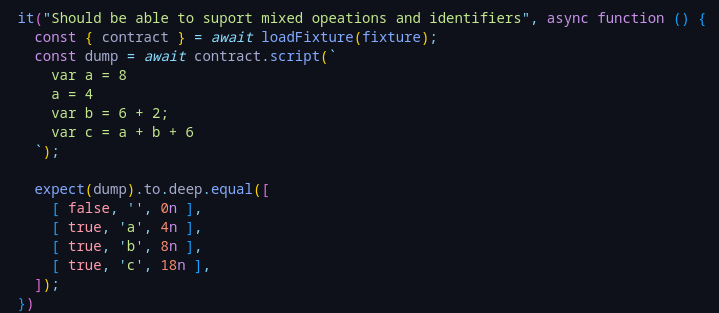

# SOJS - ECMAScript over EVM.

A runtime for ECMAScript (particularly JS flavor) on EVM, called SOJS. This allows JS to be executed inside a smart contract, without altering the contract state.

You send a string that represents a context, and it return a dump of the resulting memory. Check tests for current functionality.

Since JS uses JIT compilers, everything runs on memory storage. All functions can run using pure functions.

For now, I've only implemented a small set of tokens (EOF, Identifier, declaration using var, assign, number integer, semicolon, and sum operator). This is about ~2% of all tokens but allows me to demo it.

Also, it does not follow the paradigm about "everything is an object" (yet, because I'm figuring out how to managem memory pointers properly in Solidity without losing my head. Either private mappings, classes or private functions would have easy this).

I'm basing this project on 3 different engines: [TinyJS](https://github.com/gfwilliams/tiny-js/) (primary, due to simplicity), [Elk](https://github.com/cesanta/elk/), and finally [QuickJS](https://github.com/bellard/quickjs) . V8 proved to be very hard to abstract, partially because of performance.

On the image below, it shows a memory dump with the values and identifiers of each respective variable after processing the code.

In case anyone is wondering, I did not make the math for gas.

